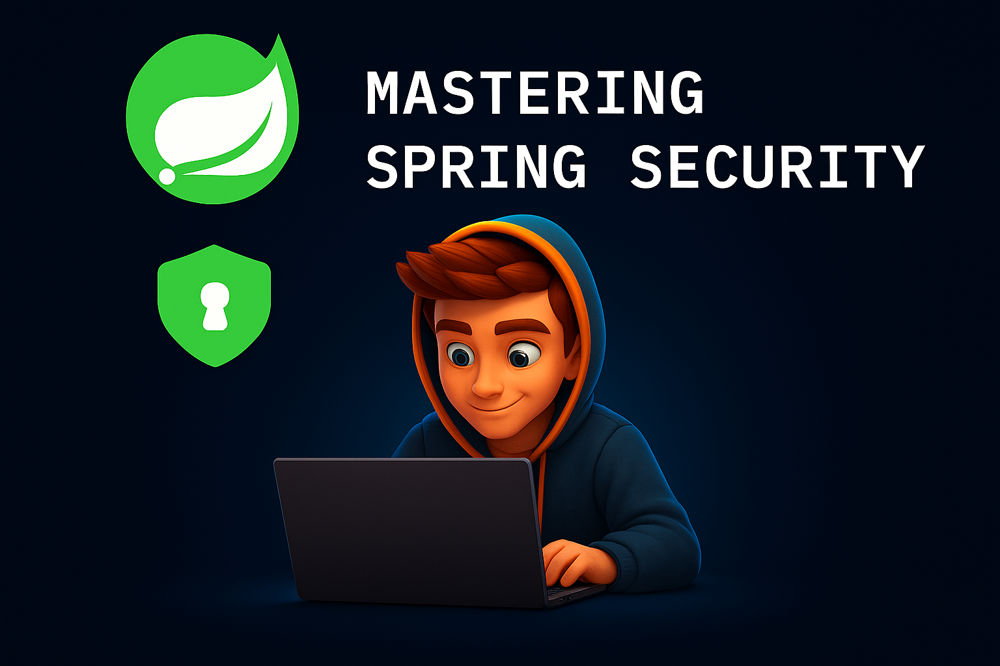

## 🔐 How I Finally Understood Spring Security (and You Can Too)

A developer’s journey to making sense of Spring Security’s core components — explained clearly with real-world examples.

Spring Security has a reputation: powerful but confusing.

I’ve been working as a Java/Kotlin Software Engineer using Spring Boot for several years. And yet — despite regularly
working with it — **Spring Security always felt intimidating**.

It seemed overly complex, with so many moving parts and unfamiliar terms:
➡️ Filters, FilterChain, Authentication, AuthenticationProvider, AuthenticationManager,
UserDetailsService, `@PreAuthorize`, `@PostAuthorize`...
It felt like too much to wrap my head around.

So I decided to **take a step back and rebuild my understanding from the ground up**.

To test and solidify what I learned, I created a series of posts explaining the core concepts — not just for myself, but
for anyone else feeling the same way.

---

### ✨ If you're a Java developer — whether you're a beginner or a seasoned engineer — this series is for you.

You’ll get practical insights into what actually matters when working with Spring Security — the foundational building
blocks that everything else is built on.

---

### 🔑 Core Concepts You Should Understand

Once you grasp these, Spring Security becomes far more predictable and less mysterious:

* **Filters**
* **SecurityFilterChain**
* **AuthenticationManager**
* **Authentication**
* **AuthenticationProvider**
* **Authority / Role**

These aren’t just buzzwords — they are core interfaces and abstractions that underpin every authentication method Spring
supports.

Whether you're working with:

* ✅ Basic Auth
* ✅ Form Login
* ✅ JWT Authentication
* ✅ OAuth2 / OIDC

…you’re building on top of these fundamental pieces.

---

### 📚 Ready to Learn?

I’ve broken the series into digestible posts, each tackling one core concept at a time:

#### Source Code:

* 🔗 [Introduction to Spring Security](https://github.com/baggio1103/spring-security-fundamentals/tree/main/basics)
* 🔗 [Custom UserDetailsService with Database Authentication](https://github.com/baggio1103/spring-security-fundamentals/tree/main/managing-users)
* 🔗 [Api-Key Authentication](https://github.com/baggio1103/spring-security-fundamentals/tree/main/custom-authentication)
* 🔗 [Authentication Providers: Implementing Multiple Authentication Providers](https://github.com/baggio1103/spring-security-fundamentals/tree/main/multi-auth-providers)
* 🔗 [Exploring Authorization: Endpoint / FilterBased Level Authorization](https://github.com/baggio1103/spring-security-fundamentals/tree/main/endpoint-authorization)
* 🔗 [Exploring Authorization: Method-Level Authorization](https://github.com/baggio1103/spring-security-fundamentals/tree/main/method-authorization)

#### Substack:

* 🔗 [Introduction to Spring Security](https://open.substack.com/pub/atomiccoding/p/spring-security-crash-course-with?r=23nm1x&utm_campaign=post&utm_medium=web&showWelcomeOnShare=false)
* 🔗 [In-memory Authentication with UserDetailsService](https://open.substack.com/pub/atomiccoding/p/spring-security-part-ii-in-memory?r=23nm1x&utm_campaign=post&utm_medium=web&showWelcomeOnShare=false)
* 🔗 [Custom UserDetailsService with Database Authentication](https://open.substack.com/pub/atomiccoding/p/spring-security-part-iii-custom-userdetailsservi?r=23nm1x&utm_campaign=post&utm_medium=web&showWelcomeOnShare=false)
* 🔗 [Api-Key Authentication](https://open.substack.com/pub/atomiccoding/p/spring-security-part-iv-custom-authentication?r=23nm1x&utm_campaign=post&utm_medium=web&showWelcomeOnShare=false)
* 🔗 [Authentication Providers: Implementing Multiple Authentication Providers](https://open.substack.com/pub/atomiccoding/p/spring-security-part-v-implementing?r=23nm1x&utm_campaign=post&utm_medium=web&showWelcomeOnShare=false)
* 🔗 [Exploring Authorization: Endpoint / FilterBased Level Authorization](https://open.substack.com/pub/atomiccoding/p/spring-security-part-vi-exploring?r=23nm1x&utm_campaign=post&utm_medium=web&showWelcomeOnShare=false)
* 🔗 [Exploring Authorization: Method-Level Authorization](https://open.substack.com/pub/atomiccoding/p/spring-security-part-vii-exploring?r=23nm1x&utm_campaign=post&utm_medium=web&showWelcomeOnShare=false)

#### Medium:

* 🔗 [Introduction to Spring Security](https://java-jedi.medium.com/spring-security-crash-course-with-kotlin-spring-boot-3953c564bb12)
* 🔗 [In-memory Authentication with UserDetailsService](https://java-jedi.medium.com/spring-security-part-ii-in-memory-authentication-with-userdetailsservice-f9ed0e911fc3)
* 🔗 [Custom UserDetailsService with Database Authentication](https://java-jedi.medium.com/spring-security-part-iii-custom-userdetailsservice-with-database-authentication-1c39d42f4d8a)
* 🔗 [Api-Key Authentication](https://java-jedi.medium.com/spring-security-part-iv-custom-authentication-with-api-key-a9f289e13964)
* 🔗 [Authentication Providers: Implementing Multiple Authentication Providers](https://java-jedi.medium.com/spring-security-part-v-implementing-multiple-authentication-providers-f80a459a5ec3)
* 🔗 [Exploring Authorization: Endpoint / FilterBased Level Authorization](https://java-jedi.medium.com/spring-security-part-vi-exploring-authorization-b34a4795fb4e)
* 🔗 [Exploring Authorization: Method-Level Authorization](https://java-jedi.medium.com/spring-security-part-viii-exploring-method-level-authorization-ba5ff6f22b10)

### 🚀 Coming Soon

Next in the series, I’ll explore:

* 🔐 Introduction to OAuth 2.0
* 🛡 Implementing an Authorization Server
* 🔓 Implementing a Resource Server
* 🌍 What is Multitenancy and Single Sign-On (SSO)?
* 🔐 Securing a Full-Stack Application (Backend + Frontend)

---
### 🙌 Let’s Connect

If you've been struggling to understand Spring Security, I hope this series brings you clarity.

📩 I’d love to hear your feedback or answer your questions in the comments!
👍 Feel free to share this with others who might find it useful.

---

Thanks for reading — happy coding, and see you in the next post!
🚀

#SpringBoot #SpringSecurity #Java #BackendDevelopment #SoftwareEngineering #Coding
